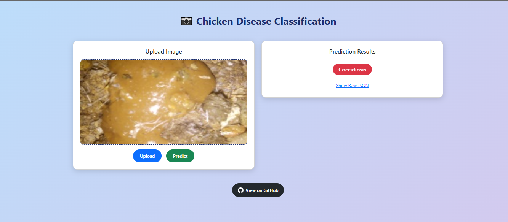

# Chicken Disease Classification – Deep Learning

A deep learning-based project to classify **chicken diseases** from images using **VGG16**.  
The project includes a **FastAPI backend** and a **colorful Bootstrap-based frontend** for real-time predictions.

---

## Screenshot of Application



---

## Features

- Deep Learning (CNN) model for disease classification
- FastAPI backend for model inference
- Colorful Bootstrap 5 UI for predictions
- Upload chicken images directly for testing
- Display of predictions with badges and raw JSON
- GitHub project link available in UI

---

## Installation

### 1. Clone the Repository

```bash
git clone https://github.com/MaryamNazir1/Chicken-Disease-Classification-Deep-learning.git
cd Chicken-Disease-Classification-Deep-learning
```

### 2. Create & Activate Conda Environment

conda create -n cnn python=3.8 -y
conda activate cnn

### 3. Install Requirements

pip install -r requirements.txt

### In order Running the Train the Model run

python main.py

### Start the FastAPI Server

python app.py
